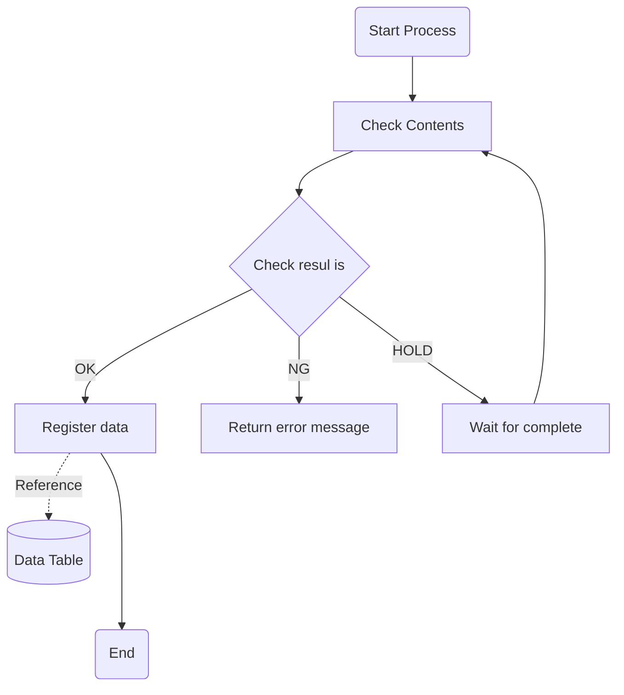

```mermaid
    graph TD
        A(Start Process)-->B[Check Contents]
        B-->C{Check resul is}
        C-->|OK| D[Register data]
        C-->|NG| E[Return error message]
        C-->|HOLD| F[Wait for complete]
        D-.->|Reference| G[(Data Table)]
        D--->H(End)
        F-->B
```

- 図形の配置が不要なのでエクセルより楽に感じる。
- 長大なフローチャートでもプレビューを横に映しながらならいい感じに作成できそう・・・？