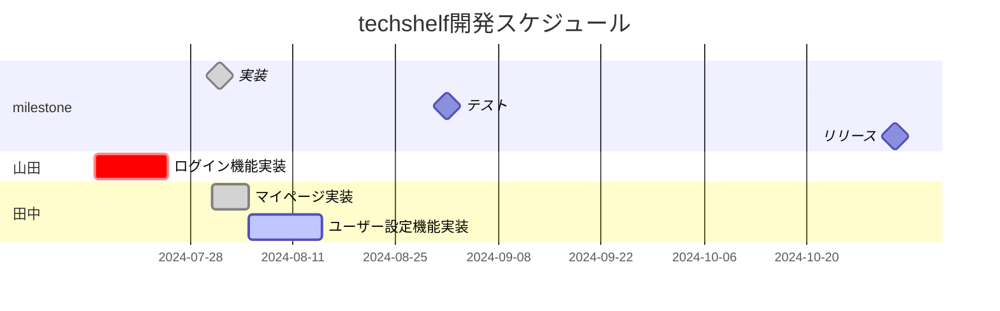

```mermaid
gantt
    title techshelf開発スケジュール
    dateFormat YYYY-MM-DD
    tickInterval 2week

    section milestone
        実装    : done, milestone, 2024-08-01, 0d
        テスト  : milestone, 2024-09-01, 0d
        リリース    : milestone, 2024-11-01, 0d
    section 山田
        ログイン機能実装    : crit, 2024-07-15, 10d
    section 田中
        マイページ実装  : done, b1, 2024-7-31, 5d
        ユーザー設定機能実装    : active, b2, after b1, 10d
```

- 予実管理はできない。
- タスクのステータスがactive, doneの２パターンなので、遅延を表現することができないのが微妙。
- 幅に収まらないパターンなどありそう。↑だと山田のログイン機能実装タスクが収まってない感ある。

